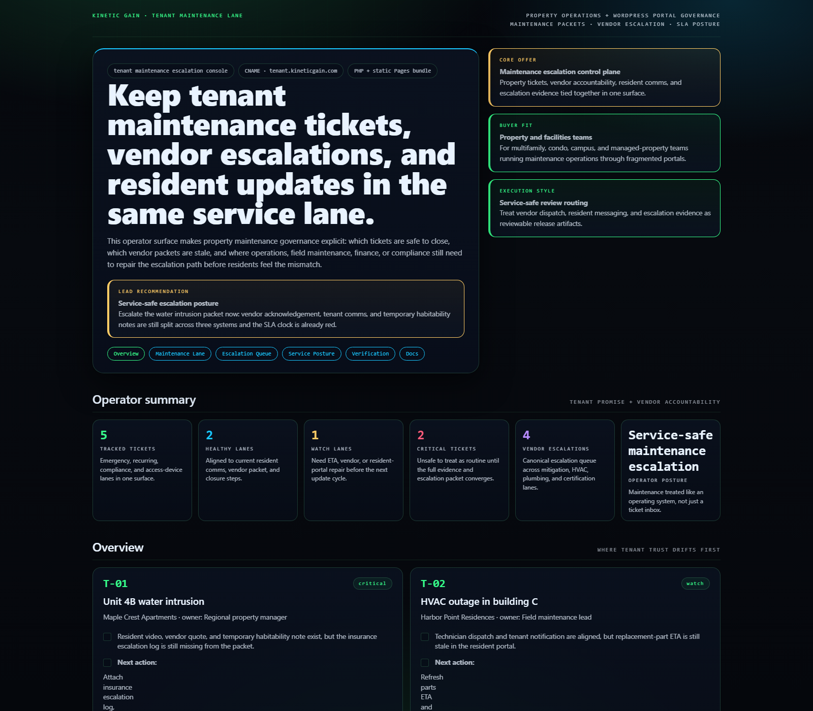
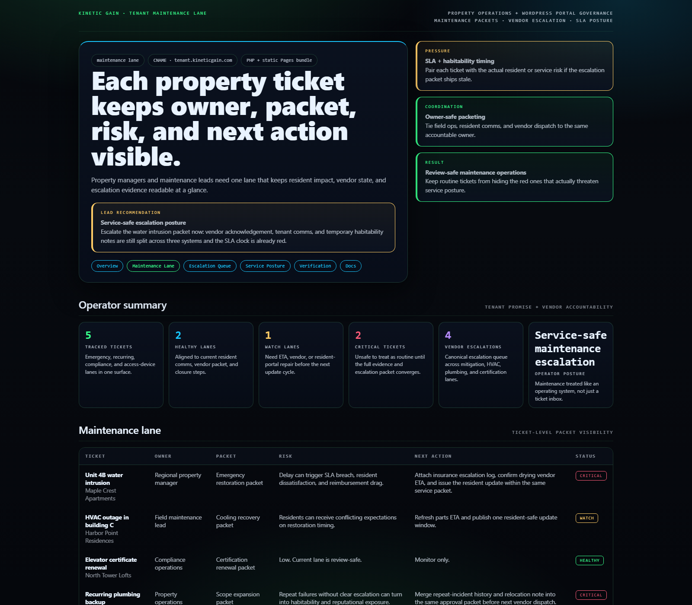
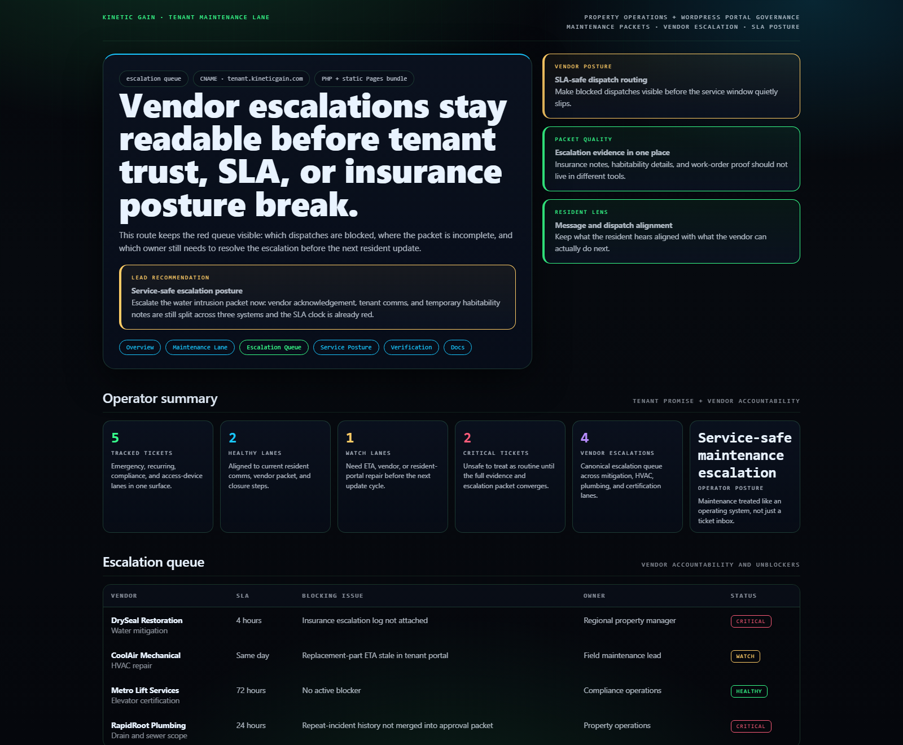
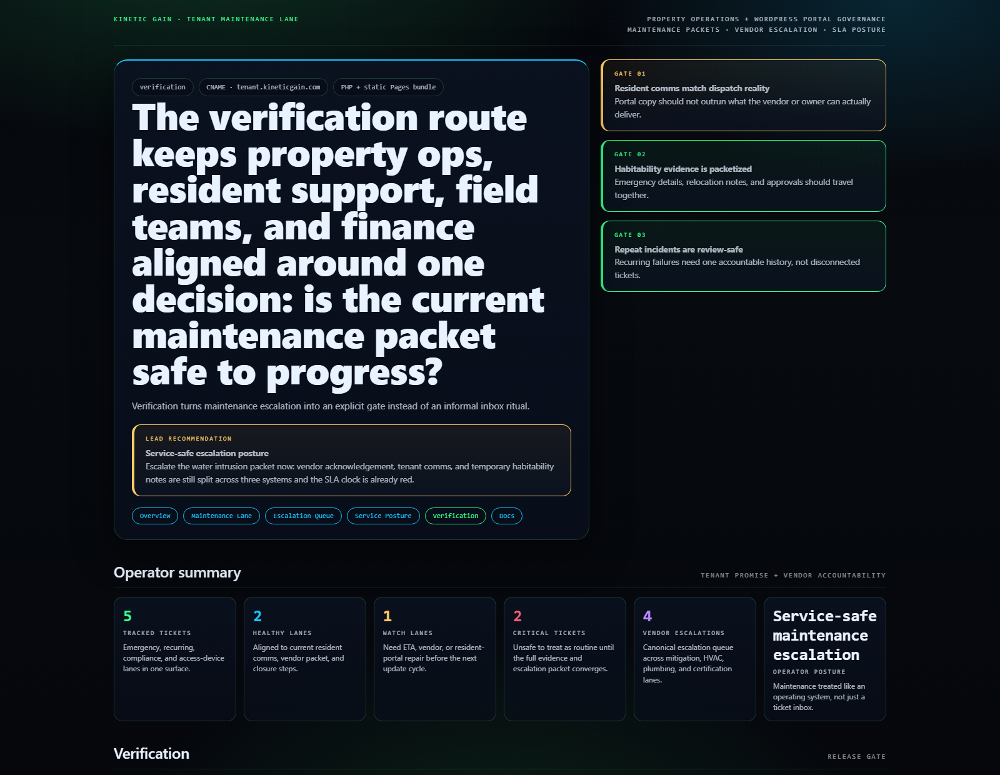

# Tenant Maintenance Escalation Console

WordPress and property-ops control plane for tenant maintenance queues, vendor escalation, SLA posture, and service-safe review routing.

## Why this exists

- Property operations usually split work orders, resident updates, vendor dispatches, and reimbursement notes across too many portals.
- Leasing, maintenance, regional operations, and finance teams need one view of which tickets are safe to close, which escalations are stale, and which resident-facing promises are already drifting.
- Tenant trust breaks when the maintenance packet, vendor reality, and resident update all say different things.

## Why this matters (KG Embedded tie-back)

This repo demonstrates the property-maintenance primitive for Kinetic Gain Embedded: resident-safe status updates, vendor accountability, repeat-incident history, and escalation gates exposed through one operator surface. In a real embedded setting, the same primitive lets multifamily, campus, and managed-property teams keep maintenance workflow, resident messaging, and service evidence aligned without shipping portal or dispatch changes blindly.

## Routes

- `/`
- `/maintenance-lane`
- `/escalation-queue`
- `/service-posture`
- `/verification`
- `/docs`

## API

- `/api/dashboard/summary`
- `/api/maintenance-lane`
- `/api/escalation-queue`
- `/api/verification`
- `/api/sample`

## Screenshots






## Local development

```powershell
cd tenant-maintenance-escalation-console
php -S 127.0.0.1:5442 .\router.php
```

Open:
- [http://127.0.0.1:5442/](http://127.0.0.1:5442/)
- [http://127.0.0.1:5442/maintenance-lane](http://127.0.0.1:5442/maintenance-lane)
- [http://127.0.0.1:5442/escalation-queue](http://127.0.0.1:5442/escalation-queue)
- [http://127.0.0.1:5442/service-posture](http://127.0.0.1:5442/service-posture)
- [http://127.0.0.1:5442/verification](http://127.0.0.1:5442/verification)

## Validation

- `php -l public\index.php`
- `php -l src\Services\TenantMaintenanceEscalationConsoleService.php`
- `php -l src\Views\render.php`
- `php -l plugin\tenant-maintenance-escalation-console.php`
- `php scripts\run_demo.php`
- `php scripts\prerender.php`
- `powershell -ExecutionPolicy Bypass -File .\scripts\smoke_check.ps1`
- `powershell -ExecutionPolicy Bypass -File .\scripts\render_readme_assets.ps1`

## Production status

| Aspect | Status |
|--------|--------|
| License | [AGPL-3.0-or-later](./LICENSE) |
| Security | [SECURITY.md](./SECURITY.md) |
| Deploy | Static prerender -> **https://tenant.kineticgain.com/** |
| WordPress primitive | Maintenance snapshot shortcode + REST route |

## Docs

- [Architecture](./docs/architecture.md)
- [Origin](./docs/ORIGIN.md)
- [Kinetic Gain Embedded tie-back](./docs/KINETIC_GAIN_EMBEDDED.md)
- [Changelog](./CHANGELOG.md)

## Part of the Kinetic Gain Suite

Operator surface in the [Kinetic Gain Suite](https://suite.kineticgain.com/) — a portfolio of buyer-readable control planes spanning compliance evidence, property operations, tenant trust, FinOps, identity posture, and operator workflows. Apex: [kineticgain.com](https://kineticgain.com/).
